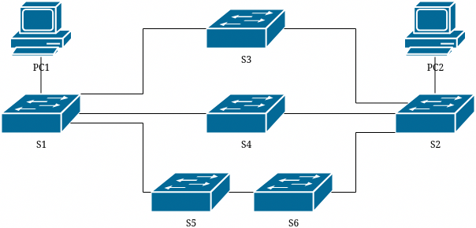
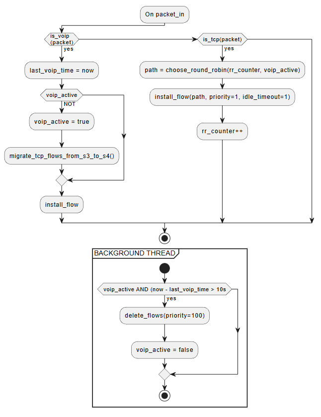

# SSP5 VoIP SDN Network

This project implements an SDN network using a Ryu controller with a dedicated topology optimized for VoIP packet flow. The network consists of 6 OpenFlow switches interconnected to create three distinct paths. The Ryu controller manages routing decisions based on current network traffic and ensures optimal flow specifically for VoIP traffic.

## Network Topology



- **Hosts**: 2 endpoints (h1, h2)
- **Switches**: 6 OpenFlow switches (s1-s6)
- **Paths**: One optimal VoIP path + two additional paths
- **Link Constraints**: 10 Mbps bandwidth, 2ms latency

## Dynamic Behavior

- **VoIP Detection**: Automatic identification of VoIP traffic
- **Path Reservation**: Dedicated path reserved exclusively for VoIP
- **Automatic Cleanup**: Inactive paths are automatically released

## Algorithm



The controller implements a dual-path routing algorithm with VoIP priority:

**Main Packet Processing Flow:**
- **VoIP Traffic**: When VoIP packets are detected, the system updates the VoIP timestamp and checks if VoIP mode is active. If not active, it triggers TCP flow migration from switch s3 to alternative paths (s4), sets VoIP mode to active, and installs VoIP flows with high priority (100) and 1-second idle timeout.
- **TCP Traffic**: Non-VoIP TCP packets are handled by a round-robin load balancer that selects paths based on VoIP status. Flows are installed with priority 1 and 1-second idle timeout, and the round-robin counter is incremented for the next connection.

**Background Monitoring Thread:**
- Continuously monitors VoIP activity every few seconds
- If VoIP has been active but no VoIP traffic detected for more than 10 seconds, it automatically deletes high-priority VoIP flows (priority 100) and sets VoIP mode to inactive, releasing the optimal path back to the round-robin pool

## Setup Ryu SDN

Check python version:
```bash
% python --version
# Python 3.9.24
```

Create venv:
```bash
% python -m venv .venv
```

Activate:
```bash
% . .venv/bin/activate
```

Install dependencies:
```bash
% pip install -r pip-requirements.txt
```

Build:
```bash
% pip install .
```

Run Ryu SDN:
```bash
% ryu-manager mininet/ryu_project.py
```

## Run Mininet

Dependencies:
- Make sure that Mininet is installed on the OS
- Make sure that you can use mininet libraries with host python installation

Run with command:
```bash
% /usr/bin/python3 mininet/topology.py
```

**PLEASE READ: RYU NOT CURRENTLY MAINTAINED**

* The Ryu project needs new maintainers - please file an issue if you are able to assist.
* see OpenStack's os-ken (<https://github.com/openstack/os-ken>) for a maintained Ryu alternative.

## What's Ryu

Ryu is a component-based software defined networking framework.

Ryu provides software components with well defined API's that make it
easy for developers to create new network management and control
applications. Ryu supports various protocols for managing network
devices, such as OpenFlow, Netconf, OF-config, etc. About OpenFlow,
Ryu supports fully 1.0, 1.2, 1.3, 1.4, 1.5 and Nicira Extensions.

All of the code is freely available under the Apache 2.0 license. Ryu
is fully written in Python.

## Quick Start

Installing Ryu is quite easy:

```bash
% pip install ryu
```

If you prefer to install Ryu from the source code:

```bash
% git clone https://github.com/faucetsdn/ryu.git
% cd ryu; pip install .
```

If you want to write your Ryu application, have a look at
[Writing ryu application](http://ryu.readthedocs.io/en/latest/writing_ryu_app.html) document.
After writing your application, just type:

```bash
% ryu-manager yourapp.py
```

## Optional Requirements

Some functions of ryu require extra packages:

- OF-Config requires lxml and ncclient
- NETCONF requires paramiko
- BGP speaker (SSH console) requires paramiko
- Zebra protocol service (database) requires SQLAlchemy

If you want to use these functions, please install the requirements:

```bash
% pip install -r tools/optional-requires
```

Please refer to tools/optional-requires for details.

## Prerequisites

If you got some error messages at the installation stage, please confirm
dependencies for building the required Python packages.

On Ubuntu(16.04 LTS or later):

```bash
% apt install gcc python-dev libffi-dev libssl-dev libxml2-dev libxslt1-dev zlib1g-dev
```

## Support

Ryu Official site is <https://ryu-sdn.org/>.

If you have any
questions, suggestions, and patches, the mailing list is available at
[ryu-devel ML](https://lists.sourceforge.net/lists/listinfo/ryu-devel).
[The ML archive at Gmane](http://dir.gmane.org/gmane.network.ryu.devel)
is also available.
